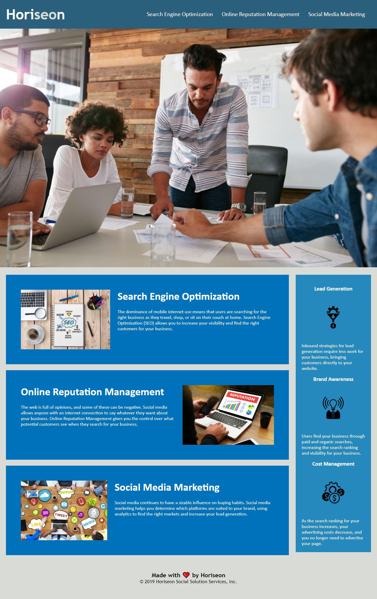

# Code Refactor

## My Task

This week I was assigned the task of refactoring a fictional marketing companies webpage. With the following brief, acceptance criteria and mock-up:

## Brief

```
AS A marketing agency
I WANT a codebase that follows accessibility standards
SO THAT our own site is optimized for search engines
```

## Acceptance Criteria

```
GIVEN a webpage meets accessibility standards
WHEN I view the source code
THEN I find semantic HTML elements
WHEN I view the structure of the HTML elements
THEN I find that the elements follow a logical structure independent of styling and positioning
WHEN I view the image elements
THEN I find accessible alt attributes
WHEN I view the heading attributes
THEN they fall in sequential order
WHEN I view the title element
THEN I find a concise, descriptive title
```

## Mock-Up

The following image shows the web application's appearance and functionality:


## Completed Work

While refactoring the code with accessibility in mind I:

* Structured the html document using semantic tags.

* Added alt tags to relevant images on the page.

* Put header tags in descending order.

* Checked for foreground/background contrast issues.

* Assured that all content was screen-readable and concise.


While refactoring the code with best practice in mind I:

* Made sure all links and references were correctly working.

* Added proper indentation and spacing.

* Removed redundancy from the CSS stylesheet.

* Restructured the CSS stylesheet following semantic structure.

* Added descriptive and best-practice comments to the CSS stylesheet.


## Screenshot of Completed Assignment




## Links

Deployed Application(GitHub Pages): https://mkotte.github.io/homework01/

GitHub Repository: https://github.com/mkotte/homework01
